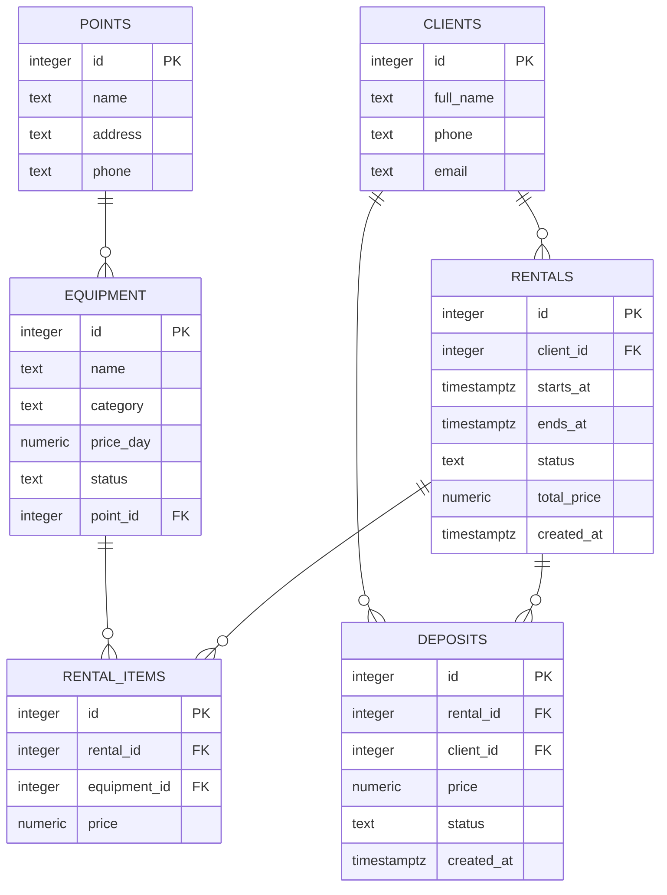

```mermaid
erDiagram
    CLIENTS ||--o{ RENTALS : ""
    POINTS ||--o{ EQUIPMENT : ""
    RENTALS ||--o{ RENTAL_ITEMS : ""
    EQUIPMENT ||--o{ RENTAL_ITEMS : ""
    RENTALS ||--o{ DEPOSITS : ""
    CLIENTS ||--o{ DEPOSITS : ""

    CLIENTS {
        integer id PK
        text full_name
        text phone
        text email
    }

    POINTS {
        integer id PK
        text name
        text address
        text phone
    }

    EQUIPMENT {
        integer id PK
        text name
        text category
        numeric price_day
        text status
        integer point_id FK
    }

    RENTALS {
        integer id PK
        integer client_id FK
        timestamptz starts_at
        timestamptz ends_at
        text status
        numeric total_price
        timestamptz created_at
    }

    RENTAL_ITEMS {
        integer id PK
        integer rental_id FK
        integer equipment_id FK
        numeric price
    }

    DEPOSITS {
        integer id PK
        integer rental_id FK
        integer client_id FK
        numeric price
        text status
        timestamptz created_at
    }
```
